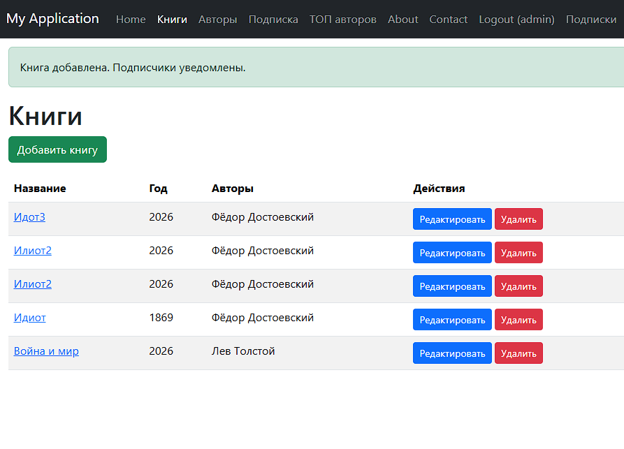
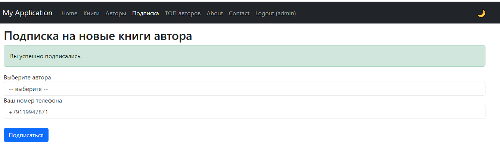
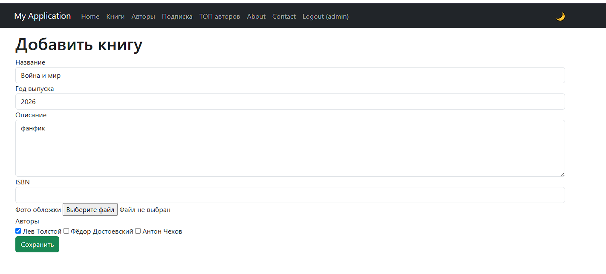
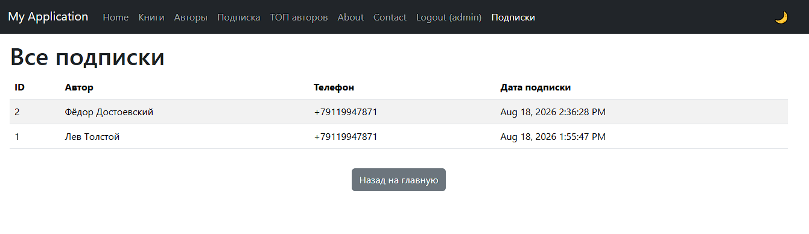
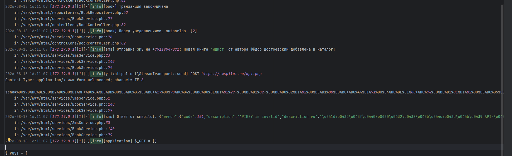

# Каталог книг на Yii2 (Basic)

## 📖 Описание проекта

Тестовое задание: веб-приложение на Yii2 + MySQL для управления каталогом книг с авторами.

**Реализовано:**

- CRUD книг (название, год, описание, ISBN, фото обложки).
- CRUD авторов (ФИО).
- Связь «многие ко многим» между книгами и авторами.
- Разграничение прав:
    - **Гость** – просмотр списков, просмотр деталей, подписка на автора, отчёт ТОП-10.
    - **Авторизованный пользователь** – всё выше + добавление, редактирование, удаление книг и авторов.
- Подписка гостя на автора (ввод номера телефона).
- SMS-уведомление о новой книге (эмуляция через smspilot.ru с ключом `emulator`).
- Отчёт ТОП-10 авторов по количеству книг за указанный год (доступен всем).
- Docker-окружение для быстрого запуска.

**Архитектура:**

- **Интерфейсы** (`BookRepositoryInterface`, `AuthorRepositoryInterface`, `SubscriptionRepositoryInterface`) – контракты для репозиториев.
- **Репозитории** – инкапсулируют работу с БД (ActiveRecord + транзакции).
- **Сервисы** – бизнес-логика (создание книги, уведомления, загрузка фото).
- **DI-контейнер** – внедрение зависимостей через конструктор.
- **Миграции** – управление схемой БД (5 таблиц).
- **Docker Compose** – php-fpm (8.2), nginx, MariaDB (10.6).

---

## 🚀 Требования

- Docker и Docker Compose (установленные в WSL Ubuntu или любой Linux).
- Порт 8080 свободен (можно изменить в `docker-compose.yml`).

---

## 📦 Установка и запуск

```bash
# 1. Клонируйте репозиторий
git clone <url> yii2-book-catalog
cd yii2-book-catalog

# 2. Запустите контейнеры
docker-compose up -d

# 3. Установите зависимости Composer
docker-compose exec app composer install

# 4. Установите пакет для HTTP-клиента (SMS)
docker-compose exec app composer require yiisoft/yii2-httpclient

# 5. Выполните миграции (создаст таблицы и пользователя admin)
docker-compose exec app php yii migrate --interactive=0

# 6. Права на папки (для загрузки фото и логов)
docker-compose exec app chmod -R 777 web/uploads runtime

# 7. Откройте в браузере
http://localhost:8080
```

## Учётные данные

- **Логин:** `admin`
- **Пароль:** `admin`

---

## Функциональность

### Для гостя (неавторизованный пользователь)

- Просмотр списка книг (`/books`).
- Просмотр деталей книги (`/book/<id>`).
- Просмотр списка авторов (`/authors`).
- Просмотр деталей автора (`/author/<id>`).
- **Подписка на автора** (`/subscribe`) – ввод номера телефона.
- **Отчёт ТОП-10 авторов** за год (`/top-authors?year=2026`).

### Для авторизованного пользователя (admin)

- Все действия гостя.
- Создание книги (`/book/create`).
- Редактирование книги (`/book/update/<id>`).
- Удаление книги (`/book/delete/<id>`).
- Создание автора (`/author/create`).
- Редактирование автора (`/author/update/<id>`).
- Удаление автора (`/author/delete/<id>`).
- **Страница «Подписки»** (`/site/subscriptions`) – просмотр всех подписок (автор, телефон, дата).

---

## Особенности реализации

- **SOLID** – каждый класс имеет одну ответственность.
- **Интерфейсы** – позволяют легко заменять реализации (например, для тестов).
- **Репозитории** – изолируют запросы к БД, поддерживают транзакции при сохранении связей.
- **Сервисы** – содержат бизнес-логику (уведомления, загрузка файлов).
- **DI-контейнер** – автоматически внедряет зависимости в контроллеры и сервисы.
- **Миграции** – управление схемой, включая тестового пользователя.
- **Docker** – изолированное окружение с PHP 8.2, Nginx, MariaDB.
- **Красивые URL** – настроен `urlManager` (например, `/books`, `/authors`).

---

## SMS-уведомления (эмуляция)

При создании новой книги система проверяет подписчиков каждого автора книги и отправляет им уведомление.

- Используется API **smspilot.ru**.
- В `params.php` задан ключ `'smsPilotApiKey' => 'emulator'` – реальной отправки не происходит, но в логах видны запросы и ответы.
- Логи можно посмотреть: `docker-compose logs app | grep "sms"`.

## Пример лога

При создании книги система отправляет SMS-уведомление подписчикам. В логах видно:

```log
Отправка SMS на +79119947871: Новая книга 'Идиот' от автора Фёдор Достоевский добавлена в каталог!
POST https://smspilot.ru/api.php
Ответ от smspilot: {"error":{"code":101,"description":"APIKEY is invalid",...}}
```

## Отчёт ТОП-10 авторов

- Доступен по адресу `/top-authors?year=2026`.
- Используется SQL-запрос с `JOIN` и группировкой.
- Выводит 10 авторов с наибольшим числом книг за указанный год.

---

## Структура БД

- `user` – пользователи (admin).
- `author` – авторы.
- `book` – книги.
- `book_author` – связи многие-ко-многим.
- `subscription` – подписки (author_id, phone, created_at).

---

## Структура проекта (ключевые папки)

```text
controllers/      – BookController, AuthorController, SiteController
interfaces/       – контракты для репозиториев
repositories/     – реализация доступа к БД
services/         – бизнес-логика (BookService, AuthorService, SubscriptionService, SmsService)
models/           – ActiveRecord-модели
migrations/       – миграции БД
views/            – представления
web/uploads/books – загруженные фото
docker/           – Dockerfile и конфиг nginx
config/           – настройки (web.php, db.php, params.php)
```

## Тестирование функционала

1. Добавление авторов – `/authors/create`.
2. Подписка – `/subscribe`, выберите автора, введите телефон.
3. Добавление книги – `/books/create`, укажите автора и заполните поля.
4. Проверка SMS – смотрите логи `docker-compose logs app | grep "sms"`.
5. Отчёт – `/top-authors?year=2026`.
6. Страница подписок – `/site/subscriptions` (только для админа).

---

## 📸 Скриншоты

### Список книг


### Добавление книги (форма)



### Управление подписками


### Логи отправки SMS (эмуляция)


---

## Ответы на вопросы из ТЗ

| Вопрос | Ответ |
|--------|-------|
| Web приложение или API? | Web |
| Нужна авторизация? | Да |
| Формат фото? | Любой, сохраняется в файловую систему (`web/uploads/books`). |
| Отчёт – PDF или страница? | Отдельная страница, доступна всем. |
| Подписка на автора или на совместные произведения? | На конкретного автора. |
| Гость – это неавторизованный пользователь? | Да. |
| Нужна регистрация гостя? | Нет, гость вводит только номер телефона для подписки. |
| Нужен администратор для управления подписками? | Нет, но для удобства добавлена страница просмотра всех подписок (для админа). |
| CRUD – к книгам и авторам? | Да. |
| Автор книги – это пользователь? | Нет, автор – отдельная сущность. |
| Отписка? | Не требуется. |
| База данных – MySQL. | Да, MariaDB. |
| Миграции? | Да, все миграции прилагаются. |
| Версии PHP и СУБД? | PHP 8.2, MariaDB 10.6. |
| Шаблон Yii2: basic или advanced? | Basic. |
| RBAC? | Не используется, достаточно AccessControl. |
| Код будут смотреть или запускать? | Достаточно просмотра, но проект полностью работоспособен. |
| Формат сдачи? | Репозиторий с кодом (без vendor, runtime, web/assets). |

---

## 📌 Примечания

- SMS-уведомления работают в эмуляционном режиме (ключ `emulator`), реальные сообщения не отправляются – это соответствует ТЗ.
- Все ошибки при отправке SMS логируются, но не влияют на сохранение книги.
- Для запуска требуется Docker и Docker Compose.

